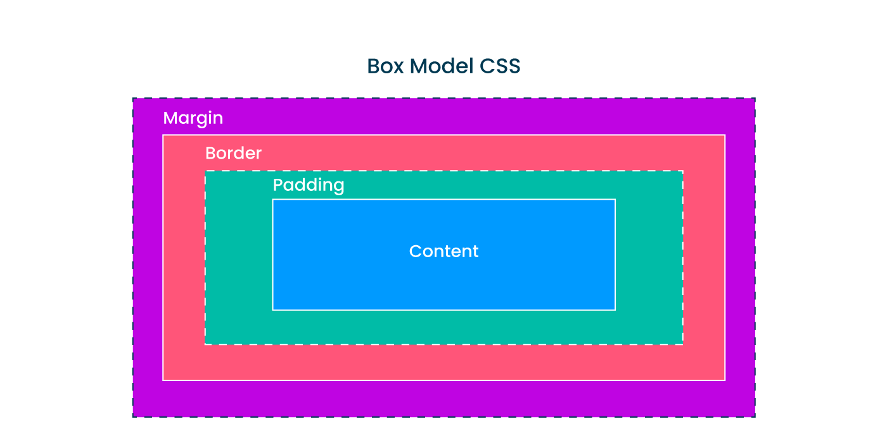
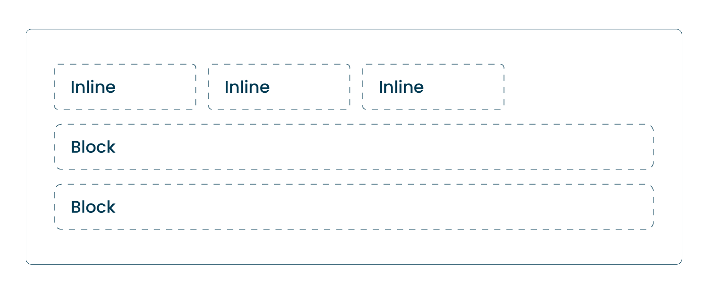
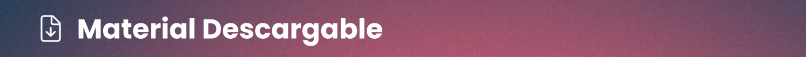
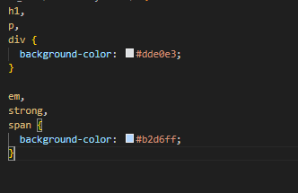
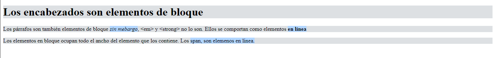

# clase_02
# 🏠 Paso 4 - ¡Introducción al modelo de Cajas!
👋 ¡Bienvenido a tu siguiente paso! 
¡Hola! Seguimos avanzando 👟

Como mencionamos en pasos previos, el HTML está compuesto por etiquetas, estas etiquetas son los elementos que conforman cada página web y esos elementos son contenedores que van estructurando nuestro sitio y a las cuales le agregamos contenido. 

Para CSS este concepto también es muy importante porque cada elemento HTML es considerado como una "caja" que consta de cuatro partes: 

* Content

* Padding

* Border

* Margin



Mira el siguiente video para ver cómo está compuesto el Modelo de Cajas en CSS:
🎬 https://youtu.be/gm04v_aRFKs

Así como en CSS es importante el modelo de cajas, en HTML es importante distinguir entre elementos en  bloque (block) y elementos en línea (inline). Los elementos en bloque ocupan el total del ancho que se establece (esto significa que los elementos en bloque comienzan en una nueva línea y empujan a otros elementos hacia abajo). Mientras que los elementos en línea ocupan solo el espacio necesario dentro de una línea de texto, permitiendo que otros elementos se sitúen junto a ellos en la misma línea.

Veamos un ejemplo:



Aquí es donde encontrarás el material descargable que complementará los ejercicios prácticos que vamos a ver en los siguientes pasos. 

Para tu primer encuentro en vivo tienes que leer solo el material que te compartimos a continuación 👉 Modelo de Cajas y elementos en bloque y en línea

📢 ¡Importante!

* No debes memorizar, concéntrate en entender el concepto. La práctica hará que luego puedas aplicarlo con más agilidad.

* Si hay algo que no comprendes, ¡no te preocupes! Anótalo y pregunta a tus compañeros o mentor en el encuentro en vivo. 


Así como en los pasos anteriores te pedimos que descargues Visual Studio Code, ahora, para realizar los próximos pasos te presentamos la extensión  “Live Server”. 

Visual Studio Code posee muchas extensiones que hacen nuestra programación más fácil y eficiente. 

Ahora que has practicado con tu HTML, instala “Live Server”, que agrega la función de ver tus cambios de forma sincrónica en el navegador.

Mira como hacerlo en el siguiente video:
https://youtu.be/z3YBKqeSD6k


Asegúrate de:

* Descargar el material teórico

* Instalar y probar el Live Server

¡Vamos! 🚀 en los próximos pasos pondremos en práctica estos conceptos

# 👣 Paso 5 - ¡A practicar!

👋 ¡Bienvenido a tu siguiente paso!
En este paso vamos a ver cómo funciona el modelo de cajas y entender cómo se comportan los elementos en bloque vs los elementos en línea. 

Podemos mencionar como elementos en bloque 

```html:
<div>: Es un contenedor genérico que se utiliza para agrupar otros elementos y aplicarles estilos CSS o realizar manipulaciones con JavaScript.

<p>: Representa un párrafo de texto.

<h1>, <h2>, ..., <h6>: Son los encabezados, siendo <h1> el de mayor jerarquía y <h6> el de menor.

<ul>, <ol>, <li>: Se utilizan para crear listas, ya sean desordenadas (<ul>) o ordenadas (<ol>), y cada elemento de la lista se representa con <li>.

<table>, <tr>, <td>, <th>: Se utilizan para crear tablas.

Podemos mencionar como elementos en línea

<span>: Similar a <div>, pero es un contenedor en línea. Se utiliza para aplicar estilos o JavaScript a una porción de texto.

<a>: Define un enlace (hipervínculo) a otra página o recurso.

: Se utiliza para incrustar imágenes.

<strong> y <b>: Se utilizan para dar énfasis al texto, haciéndolo negrita. Aunque visualmente son similares, <strong> tiene un significado semántico de mayor importancia o seriedad.

<em> y <i>: Se utilizan para dar énfasis al texto, haciéndolo cursiva. Al igual que con <strong> y <b>, <em> tiene un significado semántico de énfasis, mientras que <i> es simplemente una representación visual.

¡Vamos! 🚀


## Test
Actividad - Practicando con el Modelo de Cajas
El objetivo de esta actividad es practicar el modelo de cajas 

Para ello, sigue estos pasos en tu computadora, y luego comparte con tus compañeros: 

1. Dentro de la estructura de carpetas donde vienes trabajando, crea una nueva carpeta dentro de PWDC que se llame 📁 css-modelo-de-cajas. (Esta no se encuentra dentro mi_primera_web, sino que se encuentra a la misma altura.)

2. Dentro de ella, crea un archivo HTML llamado cajas.html y coloca el siguiente código

```html:
<!DOCTYPE html>
<html lang="es">
  <head>
    <meta charset="UTF-8" />
    <title>Modelo de cajas</title>
    <link rel="stylesheet" href="box-styles.css" />
  </head>
  <body>
    <h1>Los encabezados son elementos de bloque</h1>

    <p>
      Los párrafos son también elementos de bloque <em>sin mebargo</em>,
      &lt;em&gt; y &lt;strong&gt; no lo son. Ellos se comportan como elementos
      <strong>en línea</strong>
    </p>

    <div>
      Los elementos en bloque ocupan todo el ancho del elemento que los
      contiene. Los <span>span, son elemenos en línea. </span>
    </div>
  </body>
</html>

3. Crea el archivo box-styles.css en la misma carpeta que cajas.html (en el HTML que te brindamos ya se encuentra vinculado si mantienes los nombres de los archivos tal como están escritos).

4. Coloca el siguiente código css en el archivo box-styles.css

Test
Aquí lo que estamos haciendo es aplicar un color de fondo para los elementos HTML que se comportan como bloque y otro para los elementos que se comportan como en línea. 

💡Tip: Si más de un elemento contiene los mismos estilos de CSS, podemos separar a los selectores con una coma, y luego escribir una sola vez las propiedades y valores. Ejemplo: elemento1, elemento2, elemento3 {propiedad:valor;}

Al final deberían obtener una página similar a la siguiente:

Test
5. Al elemento h1, aplicarle un padding de 50px, margin de 50px y border 5px solid black.

💡Tip: Para la propiedad border, lo que hicimos es darle un ancho en pixels al borde (5px), indicarle que deberá ser sólido (solid), y de color negro (black).

6. Al elemento div, aplicarle el siguiente padding: 10px 5px 15px 3px; (De esta manera, al asignar "10px 5px 15px 3px" se está indicando un margen superior de 10px, uno derecho de 5px, un margen inferior de 15px e izquierdo de 3px)

7. Agrega border, margin y padding al resto de los elementos y visualiza cómo se comportan.

📌 Importante: Un concepto clave en html es el de "indentar" el código. Esto se refiere a agregar sangrías para hacerlo más legible y estructurado. Aunque el navegador no interpreta los espacios adicionales o tabulaciones en el código HTML, indentar es una buena práctica para los desarrolladores, ya que ayuda a visualizar la estructura del documento y la relación entre los elementos.

Una extensión de Visual Studio Code, que ayuda en esta organización, es 👉 Prettier

¿Cómo logro esto? Si tienes dudas sobre indentar el código, pueden ver el siguiente video:
https://youtu.be/4_LrXhFjDDw


# 👣 Paso 6 - Propiedades básicas de CSS

👋 ¡Bienvenido a tu siguiente paso! 
Ya hemos visto algunas propiedades en CSS como color y background-color. Te dejamos una lista de las propiedades más comunes: 

color: black; → Cambiar el color de la fuente del elemento seleccionado

background-color: black; → Cambiar el color de fondo del elemento seleccionado

font-family: Arial; → Cambiar el tipo de letra del elemento seleccionado

font-size: 12px; → Cambiar el tamaño de letra del elemento seleccionado

margin: 12px; → Cambiar el margen del elemento seleccionado. Espacio entre el borde y el siguiente elemento

padding: 12px; → Cambiar el espaciado interno del elemento seleccionado. Espacio entre el contenido del elemento y su borde

Border: 1px solid black; → Agregar un border al elemento

En esta primera parte de CSS vamos a ver cómo aplicar estilos utilizando selectores de etiqueta (#spoileralert, existen otros selectores que veremos más adelante). Los selectores de etiqueta apuntan a seleccionar elementos de HTML puntuales como div, h1, span, etc. 


## Actividad - Practicando propiedades en CSS
El objetivo de esta actividad es practicar y agregar propiedades de CSS a diferentes elementos. 

¡Manos a la obra!

Ingresar a la siguiente página → www.codepen.io, y hacer clic en el botón de “Start coding” que se encuentra en la columna izquierda de la pantalla.

En la pestaña de HTML, colocar el siguiente código:
```html:
<html>
  <head>
    <title>Ejemplo de CSS</title>
  </head>
  <body>
    <h1>Introducción a CSS</h1>
    <p>CSS es un lenguaje que se utiliza para dar estilo a los HTML con elementos como colores, fuentes y espaciado para generar páginas web visualmente atractivas.</p>
  </body>
</html>

3. En la pestaña de CSS, utilizar las siguientes propiedades para modificar el estilo de las etiquetas “h1” y “p”: 

* color (blue, red, green, pink, etc.)

* background-color (black, orange, yellow, etc.)

* font-family (arial, helvetica, etc.)

* font-size (medidas tales como 20px, 40px, etc.)

margin (medidas tales como 20px, 50px, 100px, etc.)

4. Experimentar con diferentes valores para cada propiedad para lograr un diseño que te guste.

Tanto el título como el párrafo te deberían quedar con: un color de fuente, un color de fondo, un tipo y tamaño de letra y un margen diferente al original.

Te mostramos un ejemplo de un posible diseño a modo de inspiración: 


Hay ciertos puntos a tener en cuenta que esperamos que puedan aprender para las próximas clases, ya que iremos profundizando sobre los mismos. 

Todos los elementos de HTML tienen margin, padding, border y content. Es decir, que usan el modelo de cajas. 

Los elementos HTML se pueden dividir entre elementos en bloque y elementos en línea. Si bien con CSS podemos modificar este comportamiento, diferenciar estos comportamientos nos permite entender por qué algunos elementos se colocan uno debajo del otro y otros al costado. 

Para mantener un código organizado y legible es importante indentar el código, de manera que se pueda diferenciar de manera clara, qué elementos contienen a otros. 

⏭️ En el próximo paso veremos HTML semántico y otras formas de seleccionar elementos en CSS.


